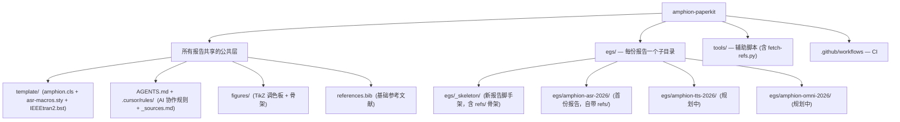

# Amphion PaperKit

Amphion PaperKit 是写学术 paper / 技术报告的通用工程框架：一份 mono-repo 提供共享公共层（LaTeX 模板、AI 协作规则、辅助脚本、CI），多份独立报告各自住在 `egs/<slug>/` 子目录下、互相隔离不交叉引用。命名沿用 [Amphion](https://github.com/open-mmlab/Amphion) 出品方约定；首批报告由 Amphion 团队孵化，但框架本身与具体研究方向（ASR / TTS / Audio-LLM / 其它）解耦，任何研究组都可以 fork 复用。



## 设计要点

| 维度 | 选择 |
| --- | --- |
| 仓库形态 | 单仓库；每份报告各自住在 `egs/<slug>/` 子目录，互相独立 |
| LaTeX 模板 | `template/amphion.cls`（v0.1，从 X-LANCE pre-print 模板 fork）；新增 amphion 主题（warm ivory + petrol teal）作为默认 |
| 主题 option | 默认 amphion / `[xlance]` 红 / `[opendfm]` 蓝紫；`[withlogo]` 正交可叠加恢复 logo |
| 报告隔离 | 每份报告自带 main.tex / sections / figures / refs / ack；不跨报告引用对方源文件 |
| 模板演进 | 改 `template/amphion.cls` 必须更新 `template/CHANGELOG.md` 并 build 至少 2 个 egs；详见 AGENTS.md 规则 8 |
| 参考资料归属 | 每份报告完全自维护 `egs/<slug>/refs/`（含论文 PDF / 数据集 datasheet / 商用系统资料 / leaderboards / 内部 docs）；通用写作方法学源在 `.cursor/rules/_sources.md` |

## 起一份新报告

```bash
tools/new-report.sh amphion-tts-2026 \
  --title     "AmphionTTS: ..." \
  --shortname "AmphionTTS" \
  --author    "Amphion TTS Team" \
  --venue     "arXiv" \
  --maintainers "@user1, @user2"
```

脚本会从 `egs/_skeleton/` 派生一个新 egs，自动替换 main.tex / REPORT.md / ack/llm-usage.md 中的 `<<NAME>>` 占位符。后续步骤：填 sections / 把内部文档放到 `egs/<slug>/refs/docs/` / 在下面"活跃报告"表中加一行。详见 [egs/README.md](egs/README.md)。

## 编译一份报告

```bash
cd egs/<slug>
PATH=/Library/TeX/texbin:$PATH latexmk -pdf main.tex
```

或一次编所有报告：

```bash
tools/build-all.sh
```

## 同步到 Overleaf

每份报告是 mono-repo 的叶子节点（`egs/<slug>/main.tex` + 顶层 `template/`），不能直接拖到 Overleaf：Overleaf 要求 `main.tex` 在项目根，且不允许跳出项目根读文件（本地 latexmkrc 里的 `TEXINPUTS=../../:` 在 Overleaf 沙箱里失效）。

用打包脚本把指定报告 + 模板扁平化成一个独立项目：

```bash
tools/overleaf-pack.sh amphion-asr-2026
```

输出：

- `build/overleaf/amphion-asr-2026/` — 扁平目录，`main.tex` 在根、`template/` 平铺在旁边
- `build/overleaf/amphion-asr-2026.zip` — 同名 zip，方便 Overleaf "Upload Project"

打包时会先在 `egs/<slug>/` 跑一次 `latexmk -pdf` 确保 `figures/*.pdf` 最新，然后排除 `refs/` / `.cursor/` / `REPORT.md` / `latexmkrc` / LaTeX 中间产物。

上传方式：

- A. 新建项目：Overleaf → New Project → Upload Project → 选 `.zip`
- B. 持续同步（Overleaf Premium Git Bridge）：
  ```bash
  git clone https://git.overleaf.com/<id> overleaf-mirror
  tools/overleaf-pack.sh amphion-asr-2026 --no-zip --output-dir overleaf-mirror
  cd overleaf-mirror && git add -A && git commit -m "sync from mono-repo" && git push
  ```
  脚本会保留 `overleaf-mirror/.git/`，只覆盖项目内容。

注意：当前流程是单向（mono-repo → Overleaf）；如果在 Overleaf 上手改了 sections，需要手工 diff 回 `egs/<slug>/`，把 Overleaf 当成 review / 共享的快照，而不是第二个 source of truth。

## 活跃报告

| slug | 路径 | 状态 | 维护者 | 投稿目标 | PDF |
| --- | --- | --- | --- | --- | --- |
| amphion-asr-2026 | [egs/amphion-asr-2026/](egs/amphion-asr-2026/) | active | TBD | arXiv | TBD |

每份报告的元数据由其 `egs/<slug>/REPORT.md` 维护；上表只是汇总视图。本表新加一行的同时，请在同一 PR 内更新对应报告的 `REPORT.md`，避免上表与单份报告的真实状态对不上。

## 协作规范

- 全局规则：[AGENTS.md](AGENTS.md)
- 细化规则：`.cursor/rules/`
  - paper-writing.mdc — 写作风格、章节结构、anti-hallucination、回复必含 fact-check block
  - latex-engineering.mdc — LaTeX 工程约定（文件布局、bib key、单位、编译流程）
  - asr-domain.mdc — WER 上报规范、baseline 选择、数据/模型/训练/鲁棒性的报告项
  - reproducibility.mdc — 代码/模型/数据 release 标准、model card、ICLR/NeurIPS LLM 披露
  - multi-report.mdc — 多报告边界：当前在哪个 egs / 是否要改公共层 / 模板 fork 流程

## 参考资料

每份报告自维护 `egs/<slug>/refs/`，包含论文 PDF (notes/papers/)、数据集 datasheet (datasets/)、商用系统资料 (notes/commercial-systems.md)、评测榜单 (leaderboards/)、内部文档 (docs/、internal/)。`INDEX.yaml` 是 PDF 清单的权威来源（标题、URL、sha256 都以它为准）；PDF 不入 git，由 [`tools/fetch-refs.py`](tools/fetch-refs.py) 按 yaml 下载并做 sha256 校验。

通用写作方法学（评审 / 复现 / 写作建议 / agent 协作 / LaTeX 工程）的源汇总在 [`.cursor/rules/_sources.md`](.cursor/rules/_sources.md)，所有报告共享一份。

## 模板版本

当前版本：`template/amphion.cls` v0.1（参见 [template/CHANGELOG.md](template/CHANGELOG.md)）。

## 本地依赖

需要 TeX Live 2026（或同等支持 Palatino + tcolorbox 的发行版）：

```bash
brew install --cask mactex-no-gui
eval "$(/usr/libexec/path_helper)"
```

最小 tlmgr 包集合（裸装 BasicTeX 时需要补）：

```
tlmgr install collection-fontsrecommended tgpagella mathpazo inconsolata \
              tcolorbox nicematrix multirow longtable tabularx adjustbox \
              enumitem cleveref natbib hyperref microtype hyphenat \
              setspace parskip babel-latin lipsum fontawesome5 url
```

参考 PDF 下载（论文 + 数据集 datasheet 不入 git）：

```bash
uv run tools/fetch-refs.py egs/<slug>
```

`tools/fetch-refs.py` 用 PEP 723 inline metadata 声明依赖（PyYAML + jsonschema），通过 [uv](https://docs.astral.sh/uv/) 自动建虚拟环境，不需要手动 `pip install`。脚本会按 `egs/<slug>/refs/{notes/papers,datasets}/INDEX.yaml` 并行下载并 sha256 校验。已存在文件 SKIP；首次下载后把 sha256 回填到 yaml，请 `git diff` 后 commit。

## License

- `LICENSE`：MIT，覆盖 amphion 自有内容（template/amphion.cls 的 fork 修改、tools、rules、scaffolding）。
- `LICENSE_arxiv-style.txt`：原 X-LANCE template 继承的 arxiv-style license。
- 单份报告可在自己的 `egs/<slug>/` 下声明独立 LICENSE（典型为 CC-BY for arXiv 预印本）。
