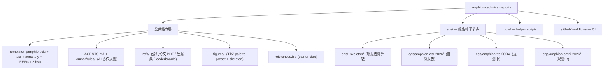

# Amphion Technical Reports

Mono-repo for Amphion 公司技术报告。顶层提供公共能力（LaTeX 模板、AI 协作规则、共享参考资料、starter bibliography、helper scripts、CI），所有具体报告住在 `egs/<slug>/` 叶子节点下，结构对齐 [k2-fsa/icefall](https://github.com/k2-fsa/icefall) 的 egs 模式。



## 设计要点

| 维度 | 选择 |
| --- | --- |
| 仓库形态 | mono-repo + `egs/<slug>/` 叶子节点（icefall 风格） |
| LaTeX 模板 | `template/amphion.cls`（v0.1，从 X-LANCE pre-print 模板 fork）；新增 amphion 主题（warm ivory + petrol teal）作为默认 |
| 主题 option | 默认 amphion / `[xlance]` 红 / `[opendfm]` 蓝紫；`[withlogo]` 正交可叠加恢复 logo |
| 报告隔离 | 每份报告自带 main.tex / sections / figures / refs / ack；不跨 egs `\input` |
| 模板演进 | 改 `template/amphion.cls` 必须更新 `template/CHANGELOG.md` 并 build 至少 2 个 egs；详见 AGENTS.md 规则 8 |
| 公共 refs vs 报告 refs | 通用论文 / 数据集 / leaderboards 在顶层 `refs/`；报告内部 plan / model card / 训练日志在 `egs/<slug>/refs/docs/` 与 `egs/<slug>/refs/internal/` |

## 起一份新报告

```bash
tools/new-report.sh amphion-tts-2026 \
  --title     "AmphionTTS: ..." \
  --shortname "AmphionTTS" \
  --author    "Amphion TTS Team" \
  --venue     "arXiv" \
  --maintainers "@user1, @user2"
```

脚本会从 `egs/_skeleton/` 派生一个新 egs，自动替换 main.tex / REPORT.md / ack/llm-usage.md 中的 `<<NAME>>` 占位符。后续步骤：填 sections / 把内部文档放到 `egs/<slug>/refs/docs/` / 在下面"活跃报告"表中加一行。详见 [egs/README.md](egs/README.md)。

## 编译一份报告

```bash
cd egs/<slug>
PATH=/Library/TeX/texbin:$PATH latexmk -pdf main.tex
```

或一次编所有 active egs：

```bash
tools/build-all.sh
```

## 活跃报告

| slug | 路径 | 状态 | 维护者 | 投稿目标 | PDF |
| --- | --- | --- | --- | --- | --- |
| amphion-asr-2026 | [egs/amphion-asr-2026/](egs/amphion-asr-2026/) | active | TBD | arXiv | TBD |

每份报告的元数据由其 `egs/<slug>/REPORT.md` 维护；上表是它们的汇总视图。本表新加一行的同时，请在同一 PR 内更新对应报告的 `REPORT.md`，避免汇总视图与单一真相源 drift。

## 协作规范

- 全局规则：[AGENTS.md](AGENTS.md)
- 细化规则：`.cursor/rules/`
  - paper-writing.mdc — 写作风格、章节结构、anti-hallucination、回复必含 fact-check block
  - latex-engineering.mdc — LaTeX 工程约定（文件布局、bib key、单位、编译流程）
  - asr-domain.mdc — WER 上报规范、baseline 选择、数据/模型/训练/鲁棒性的报告项
  - reproducibility.mdc — 代码/模型/数据 release 标准、model card、ICLR/NeurIPS LLM 披露
  - multi-report.mdc — mono-repo 边界：当前在哪个 egs / 是否要改公共层 / 模板 fork 流程

## 公共参考

`refs/` 目录由公司维护，所有报告共享：

```
refs/
├── datasets/       # 通用数据集 datasheet / paper PDF
├── notes/
│   ├── research-references.md   # 全局外部参考目录
│   └── papers/                  # 公共论文 PDF + INDEX.md
└── leaderboards/   # ASR / TTS / Audio-LLM leaderboards 截图
```

## 模板版本

当前版本：`template/amphion.cls` v0.1（参见 [template/CHANGELOG.md](template/CHANGELOG.md)）。

## 本地依赖

需要 TeX Live 2026（或同等支持 Palatino + tcolorbox 的发行版）：

```bash
brew install --cask mactex-no-gui
eval "$(/usr/libexec/path_helper)"
```

最小 tlmgr 包集合（裸装 BasicTeX 时需要补）：

```
tlmgr install collection-fontsrecommended tgpagella mathpazo inconsolata \
              tcolorbox nicematrix multirow longtable tabularx adjustbox \
              enumitem cleveref natbib hyperref microtype hyphenat \
              setspace parskip babel-latin lipsum fontawesome5 url
```

## License

- `LICENSE`：MIT，覆盖 amphion 自有内容（template/amphion.cls 的 fork 修改、tools、rules、scaffolding）。
- `LICENSE_arxiv-style.txt`：原 X-LANCE template 继承的 arxiv-style license。
- 单份报告可在自己的 `egs/<slug>/` 下声明独立 LICENSE（典型为 CC-BY for arXiv 预印本）。
