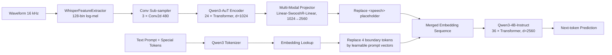

# Qwen3-ASR-AuT-Qwen3-4B-Instruct 模型架构（用于论文 Method 章节）

> 模型路径：`/ai_sds_wuzz/MODELS/Amphion/hf/Qwen3-ASR-AuT-Qwen3-4B-Instruct-hf/`
> 顶层类：`AmphionASRForConditionalGeneration`
> 实现文件：`configuration_amphion_asr.py`、`modeling_amphion_asr.py`、`processing_amphion_asr.py`、`zipformer_inference.py`、`constants.py`
> 权重校验依据：直接解析 `model.safetensors` 文件头得到的 797 个张量名与形状

## 1. 整体范式

这是一个标准的"语音编码器 + 多模态投影器 + 大语言模型"的 SpeechLLM-ASR 架构（与 SLAM-ASR / Qwen2-Audio / Whisper-LLM 同一范式）。整体上把 ASR 当作 Speech-conditioned Causal Language Modeling 任务：音频经声学塔与投影器后映射到 LLM 隐空间，在文本提示中以特殊占位符 `<speech>` 表示，由 LLM 做 next-token prediction 解码转写文本。

HuggingFace 顶层类是 `AmphionASRForConditionalGeneration`，由三个可训练子模块和一组可学习边界 prompt 向量组成。

| 组件 | 实现 / 来源 | 参数量 |
| --- | --- | --- |
| 音频编码器 audio_encoder | Qwen3-AuT (Qwen3 ASR Audio Tower) | 314.33 M |
| 多模态投影器 multi_modal_projector | Linear–SwooshR–Linear | 9.18 M |
| 语言模型 language_model | Qwen3-4B-Instruct-2507 | 4411.42 M |
| 边界 prompt embedding | 4 × 2560 的可学习向量 | 0.01 M |
| 合计 | — | 约 4.735 B |

代码中的 `_ENCODER_REGISTRY` 注册了 `qwen3asr`、`qwen3omni`、`qwen3omni_captioner`、`zipformer` 四种音频塔，本 checkpoint 通过 `config.encoder_type = "qwen3asr"` 选用 Qwen3-AuT，因此后文以该配置为准描述。

## 2. 音频编码器：Qwen3-AuT (Whisper-style)

特征侧：16 kHz 单声道波形 → `WhisperFeatureExtractor` → 128 维 log-mel。关键超参（`preprocessor_config.json`）：

| 项 | 值 |
| --- | --- |
| sampling_rate | 16000 Hz |
| n_fft | 400 |
| hop_length | 160（10 ms 步长） |
| feature_size | 128（mel bins） |
| chunk_length | 30 s |
| nb_max_frames | 3000 |

编码器结构（参数取自 `config.audio_encoder_config`，并与 safetensors 中的 393 个张量名形状逐一对齐）：

| 项 | 值 |
| --- | --- |
| 模型类型 | amphion_asr_audio_encoder (Qwen3ASRAudioEncoder) |
| 输入特征 | 128-bin log-mel |
| 卷积下采样栈 | conv2d1: (1→480, 3×3), conv2d2: (480→480, 3×3), conv2d3: (480→480, 3×3) |
| 卷积出口投影 | conv_out: Linear(7680 → 1024)，把 480×16 时频块映射回 d_model |
| Transformer 层数 | 24 |
| d_model | 1024 |
| 注意力头数 | 16 |
| FFN 维度 | 4096 |
| 激活函数 | GELU |
| Post-LN | ln_post: LayerNorm(1024) |
| max_source_positions | 1500 |
| 训练/推理窗口 | n_window=50, n_window_infer=800（按窗分块以支持长音频） |
| 编码器输出维度 | 1024 |

每个 Transformer 层的权重键为 `self_attn.{q,k,v,out}_proj` + `self_attn_layer_norm` + `fc1/fc2` + `final_layer_norm`，与 Whisper-style 的 24-layer pre-LN Transformer Encoder 一致。

注意：`config.audio_encoder_config.output_dim = 2048` 是 Qwen3-AuT 原生自带的对齐头维度，在 `Qwen3AudioEncoderWrapper._strip_proj` 中已显式置为 `nn.Identity()`，因此对外暴露的真实编码器输出维度仍是 1024：

```97:113:/ai_sds_wuzz/MODELS/Amphion/hf/Qwen3-ASR-AuT-Qwen3-4B-Instruct-hf/modeling_amphion_asr.py
class Qwen3AudioEncoderWrapper(AudioEncoderWrapper):
    """Wrapper for encoder_type ``qwen3asr`` (Qwen3-AuT via ``qwen_asr``)."""

    def __init__(self, config_dict: dict):
        super().__init__()
        from qwen_asr.core.transformers_backend.modeling_qwen3_asr import (
            Qwen3ASRAudioEncoder,
        )
        cfg = Qwen3ASRAudioEncoder.config_class(**config_dict)
        self.encoder = Qwen3ASRAudioEncoder(cfg)
        self._strip_proj()

    def _strip_proj(self):
        for attr in ("proj1", "act", "proj2"):
            if hasattr(self.encoder, attr):
                setattr(self.encoder, attr, nn.Identity())
```

下采样比可由 `Qwen3AudioEncoderWrapper.get_output_lengths` 反推：每 100 帧 mel（=1 s）大约产出 13 帧编码器输出，等效 ~76.9 ms 步长。

## 3. 多模态投影器

投影器把 1024 维音频帧映射到 LLM 的 2560 维隐空间。在 safetensors 中只有 `proj.1.{weight,bias}` 与 `proj.3.{weight,bias}` 两组参数（与 `nn.Sequential[Dropout, Linear, SwooshR, Linear]` 一一对应）。结构与超参：

```python
proj = nn.Sequential(
    nn.Dropout(0.1),
    nn.Linear(encoder_dim * downsample_rate, llm_dim),  # 1024 -> 2560
    SwooshR(),
    nn.Linear(llm_dim, llm_dim),                        # 2560 -> 2560
)
```

| 项 | 值 |
| --- | --- |
| encoder_dim | 1024 |
| llm_dim | 2560 |
| downsample_rate | 1（不做帧拼接） |
| dropout | 0.1 |
| 激活函数 | SwooshR (pure-PyTorch 实现，等价 k2.swoosh_r) |

SwooshR 来源于 Icefall/Zipformer 激活函数族，定义为：

\[
\mathrm{SwooshR}(x) = \log\!\left(1 + e^{x-1}\right) - 0.08\,x - 0.313261687
\]

Amphion 团队将其改写为纯 PyTorch，避免推理时依赖 k2 C++ 扩展，可在论文里作为工程层面的可移植性贡献。

## 4. 语言模型：Qwen3-4B-Instruct-2507

LLM 直接复用 Qwen3-4B-Instruct-2507。关键超参（取自 `config.text_config`，与 safetensors 中 398 个张量形状逐一对齐）：

| 项 | 值 |
| --- | --- |
| 架构 | Qwen3ForCausalLM |
| hidden_size | 2560 |
| num_hidden_layers | 36 |
| num_attention_heads | 32 |
| num_key_value_heads | 8（GQA，KV 头压缩比 4×） |
| head_dim | 128 |
| intermediate_size | 9728 |
| FFN | SwiGLU (gate/up/down_proj) |
| 激活函数 | SiLU |
| 归一化 | RMSNorm, eps=1e-6 |
| 位置编码 | RoPE, theta=5e6 |
| sliding_window | null（所有 36 层均为 full_attention） |
| max_position_embeddings | 262144 |
| vocab_size | 151936 |
| tie_word_embeddings | true（lm_head 与 embed_tokens 共享权重） |

`embed_tokens` 形状 `[151936, 2560]`、`lm_head` 形状 `[151936, 2560]`、36 层 Transformer 的 q/k/v/o/gate/up/down/RMSNorm 在 safetensors 中均完整存在，未发现任何 LoRA / Adapter / 量化产物，因此 LLM 主干以 full fine-tuning 形式参与训练。

## 5. 可学习的边界 Prompt Embedding

`prompt_embedding: nn.Embedding(4, 2560)` 是本工作相对常规 SpeechLLM 的一个差异化设计点。它在 `_merge_input_ids_with_speech_features` 中将四个边界特殊 token 的隐表示替换为四个可学习向量（仅作用于这些边界位置，不改变其他 token）：

| 边界 token | token_id | weight_idx |
| --- | --- | --- |
| start_text | 151670 | 0 |
| end_text | 151671 | 1 |
| start_speech | 151672 | 2 |
| end_speech | 151673 | 3 |

```456:469:/ai_sds_wuzz/MODELS/Amphion/hf/Qwen3-ASR-AuT-Qwen3-4B-Instruct-hf/modeling_amphion_asr.py
            # Inject prompt embeddings at all boundary-token positions
            _prompt_map = [
                (cfg.start_text_token_id, 0),
                (cfg.end_text_token_id, 1),
                (cfg.start_speech_token_id, 2),
                (cfg.end_speech_token_id, 3),
            ]
            for token_id, weight_idx in _prompt_map:
                positions = (active_ids == token_id).nonzero(as_tuple=True)[0]
                for p in positions:
                    active_embeds[p] = self.prompt_embedding.weight[weight_idx].to(
                        active_embeds.dtype
                    )
```

可在论文中称为 learnable modality-boundary prompts：显式告知 LLM "下一段是语音 / 是文本"，本质类似 prompt-tuning 中的 soft prompts，但只用于边界位置，仅占 4×2560 ≈ 1 万参数，开销几乎可忽略。

## 6. 特殊 Token 与 Chat 模板

在 Qwen3 原生词表（151936）之外，模型新增 5 个特殊 token（见 `constants.py` 与 `added_tokens.json`）：

| Token | ID | 作用 |
| --- | --- | --- |
| `<speech>` | 151669 | 音频占位符，被音频 embedding 替换 |
| `<start_text>` | 151670 | 文本段起始边界，由 prompt embedding 替换 |
| `<end_text>` | 151671 | 文本段结束边界 |
| `<start_speech>` | 151672 | 语音段起始边界 |
| `<end_speech>` | 151673 | 语音段结束边界 |

聊天模板沿用 Qwen `<|im_start|>role\n…<|im_end|>`，并在用户消息中将 `audio` 部分编码为 `<start_speech><speech><end_speech>`。例如中文 ASR 任务的最终 prompt：

```text
<|im_start|>user
Transcribe the following Chinese audio:<start_speech><speech><end_speech><|im_end|>
<|im_start|>assistant

```

`processing_amphion_asr.py` 中内置任务字典 `TASK_PROMPTS`：

| Task key | 提示模板 |
| --- | --- |
| asr | Transcribe the following audio:{speech} |
| asr_en | Transcribe the following English audio:{speech} |
| asr_zh | Transcribe the following Chinese audio:{speech} |
| asr_hotwords | Hotwords:{hotwords}\nTranscribe the following audio:{speech} |
| ser | Classify the emotion of the following audio:{speech} |
| sec | Describe the emotion of the following audio:{speech} |

模型同时支持热词偏置 ASR、语音情感分类（SER）和语音情感描述（SEC）。

## 7. 数据流与训练目标

训练 / 推理时的完整前向（来自 `forward` 与 `generate`）：

1. 原始波形 → `WhisperFeatureExtractor` → `(B, T_mel, 128)` log-mel
2. `audio_encoder` → `(B, T', 1024)`
3. `multi_modal_projector` → `(B, T', 2560)`
4. `language_model.get_input_embeddings()(input_ids)` 得到文本侧 `(B, L, 2560)`
5. `_merge_input_ids_with_speech_features` 做三件事：
   - 把 `<speech>` 占位符按左→右顺序替换为各自的音频特征序列（支持一条 prompt 内多段音频）；
   - 把四个边界 token 的 embedding 用 `prompt_embedding` 覆盖；
   - 以"先翻转→pad→再翻转"的技巧实现 left-padding 语义，保证 batched autoregressive 解码对齐。
6. 拼接后的 `inputs_embeds` 输入 Qwen3-4B 做 next-token prediction；训练 loss 由 `language_model` 自身的 cross-entropy 计算，音频位置 label 置为 `IGNORE_TOKEN_ID = -100`，只在文本答案 token 上计损失。
7. `forward` 还会顺便计算 token-level accuracy（仅 metric，不参与梯度）。

形式化地，训练目标为：

\[
\mathcal{L}(\theta) = - \sum_{t \in \mathcal{T}_{\text{ans}}} \log p_\theta \!\left( y_t \,\big|\, y_{<t},\, \mathbf{H}_{\text{audio}},\, \mathbf{H}_{\text{text}} \right)
\]

其中 \(\mathbf{H}_{\text{audio}} = \mathrm{Proj}\!\left(\mathrm{AudioEncoder}(\mathbf{x}_{\text{mel}})\right)\)，\(\mathbf{H}_{\text{text}}\) 中边界位置由 learnable prompt 覆盖，\(\mathcal{T}_{\text{ans}}\) 仅包含 assistant 回答的 token 索引。

## 8. 推理与工程要点（Implementation Details 素材）

- 长音频分块：`n_window_infer = 800` 对应推理时按更大窗口对编码器做分块前向，突破 30 s Whisper 限制。`Qwen3AudioEncoderWrapper.forward` 还按 batch 内逐条处理以兼容变长输入。
- 解码：`generate` 仅以 `inputs_embeds + attention_mask` 调入 LLM，复用 Qwen3 的 KV-cache；`past_key_values is not None` 时跳过编码器与 merge 逻辑，避免重复计算。
- 词表绑定：`tie_word_embeddings = true`，即 `lm_head.weight ≡ embed_tokens.weight`，但 safetensors 仍保存了一份独立的 `lm_head.weight`。
- 依赖剥离：把 SwooshR 改成纯 PyTorch、把 Zipformer 编码器拷成单文件 `zipformer_inference.py`（2362 行），整套推理无需 k2 / icefall。
- 兼容旧 ckpt：`_migrate_old_state_dict` 自动把旧版 `audio_encoder.*` 重映射为 `audio_encoder.encoder.*`，论文里可一笔带过。
- 编码器可替换：`build_audio_encoder` 工厂支持 Qwen3-AuT / Qwen3-Omni / Zipformer 即插即用，便于消融实验。

## 9. 整体数据流示意（Mermaid，可直接生成 Figure 1）



## 10. 一句话总结（可放论文 Abstract / Method 开头）

我们采用"Qwen3-AuT 音频塔 + 线性–SwooshR–线性 投影器 + Qwen3-4B-Instruct 解码器"的三段式 SpeechLLM 架构：128-mel log-mel 经 3 层卷积下采样与 24 层 1024 维 Whisper-style Transformer 编码后，由约 9 M 参数的两层 MLP 投影到 LLM 的 2560 维隐空间，并通过 4 个可学习边界 prompt 与特殊 token (`<speech>` / `<start_speech>` / `<end_speech>` 等) 与 Qwen3-4B-Instruct 的文本上下文统一拼接，进行 cross-entropy 监督的 next-token 预测；模型总参数约 4.74 B，其中音频塔 314 M、LLM 4.41 B、投影器 9 M、边界 prompt 1 万。

---

附：可选的论文 Figure / Table 建议

- Figure 1：整体数据流（见第 9 节 Mermaid，可改画成 TikZ）。
- Figure 2：音频编码器细节（conv stem + 24-layer Transformer，标注 d_model=1024 / heads=16 / FFN=4096）。
- Table 1：组件参数量统计（见第 1 节）。
- Table 2：LLM / 音频编码器超参（见第 2、4 节）。
- Table 3：任务模板与特殊 token 列表（见第 6 节）。
