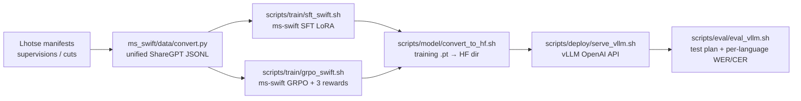

# AmphionASR Integrations 任务实现与 Prompt 构造详解（论文素材）

> 范围：`src/integrations/` 下三个子框架（HuggingFace / ms-swift / vLLM）+ 数据转换 + 入口脚本。
> 目标：将训练数据构造、训练（SFT / GRPO）、奖励函数、部署、评测各环节的 prompt 模板与关键实现细节集中到一处，方便写入论文 Method / Implementation Details / Appendix。

## 0. 总览

`src/integrations/` 是三块"模型对接外部生态"的胶水代码。论文层面可以一句话总结为：

我们将自研的 `AmphionASRForConditionalGeneration` 同时挂接到三个生态——HuggingFace（统一权重格式与远程代码加载）、ms-swift（SFT 与 GRPO 训练）、vLLM（高吞吐 OpenAI 兼容服务），并通过单一"统一 prompt 模板"在数据转换、训练、评测、奖励四个环节保持比特级一致。

```
src/integrations/
├── huggingface/   # HF PreTrainedModel 实现 + 训练 ckpt → HF 模型目录转换
├── ms_swift/      # 训练侧：注册模型/模板、Lhotse → ShareGPT 数据转换、GRPO 奖励
├── vllm/          # 推理侧：out-of-tree vLLM 插件 + OpenAI 兼容评测客户端
└── scripts/
    ├── data/      # convert_sharegpt.sh
    ├── model/     # convert_to_hf.sh / merge_lora.sh
    ├── deploy/    # serve_vllm.sh
    ├── eval/      # eval_vllm.sh
    └── train/     # sft_swift.sh / grpo_swift.sh / run_rollout_server.sh
```

整体的数据流（论文里可作 Figure"训练—部署—评测"统一管线）：



## 1. 统一 Prompt 模板（核心约定，全文都基于它）

整个仓库共维护两套 prompt 风格，论文中需要明确说明。两者均以单条 user 消息承载，answer 永远是"裸转写文本"（hard-negative 样本则为空字符串）。所有特殊 token（`<start_speech>` / `<speech>` / `<end_speech>`）由 chat template 在音频片段位置自动注入，prompt 文本本身不出现这些 token。

### 1.1 Swift 风格（与 ms-swift 训练 + GRPO 对齐，默认）

由 `src/integrations/ms_swift/data/convert.py:build_unified_instruction` 构造：

```text
[Given the speaker's voice:<audio>          ]   # 仅当 has_enrollment=True
[Transcribe what this speaker says in the following audio.]  # 有 enrollment
[Transcribe the following audio.            ]   # 无 enrollment
[Language: <Canonical English Name>         ]   # 概率保留
[Hotwords: hw1,hw2,...                       ]   # 概率保留
<audio>                                          # 始终存在（mixed）
```

要点：

- 主指令末尾用句号 `.`，让 vLLM chat template 把后续的 `<audio>` block 作为独立 content item 接续。
- Language 取自每条 supervision 的 `language` 字段，经 `normalize_language` 映射到规范英文全称（如 `zh` → `Chinese`，`en-us` → `English`）；未命中的值原样保留并在 worker 一次性告警，便于扩展。
- Hotwords 行只在 `prompt_hotword_prob` 命中时输出；当未命中或候选为空（`N/A`）时整行省略。
- enrollment 由数据驱动（不做概率掩码）：`custom.enrollment_audio` 存在则首段是 enrollment 音频，否则没有 enrollment 行。

### 1.2 Train 风格（与 `src/train.py` icefall-style 训练 ckpt 对齐）

`src/integrations/vllm/test_vllm_inference.py:_build_content_train` 维护，与 `src/train.py:TASK_PROMPTS` 字节级一致。与 swift 风格的 5 个关键差异如下表（必须严格对齐，否则评测会出现 hotwords 复读、WER 暴涨）：

| 维度 | swift | train |
| --- | --- | --- |
| 行顺序（asr_hotwords） | Transcribe → Language → Hotwords → audio | Hotwords → Transcribe → audio |
| Hotwords 行格式 | `Hotwords: hw1,hw2`（冒号后带空格） | `Hotwords:hw1,hw2`（冒号后无空格） |
| 主指令末尾标点 | `... audio.`（句号） | `... audio:`（冒号紧贴 audio block） |
| Language 行 | 可选输出 `Language: zh-cn` | 永不渲染 |
| TS-ASR / SER / SEC / ESC | 句号收尾 + 独立 audio block | 冒号收尾紧贴 audio block |

Train 风格还有 `Hotwords:N/A` 兜底：当任务为 `asr_hotwords` 但 hotwords 为空（K=0 baseline）时渲染 `Hotwords:N/A`，与训练侧 `_build_hotwords_prompt` 在 `hotword_prob` 未命中时的行为一致；普通 ASR spec 则完全不出现 Hotwords 行。

### 1.3 Chat Template（音频特殊 token 的注入位置）

模型 HF 目录里的 `chat_template.jinja`（`src/integrations/huggingface/convert_amphion_to_hf.py:CHAT_TEMPLATE_JINJA` 写入）在遇到 OpenAI-style 多模态 content 数组里的 `{"type": "audio"}` 时自动插入 `<start_speech><speech><end_speech>`：

```jinja

    
        
    
        
    

```

因此：训练数据 JSON、训练 template、vLLM 请求 content list 都只需要在合适位置塞 `{"type": "audio"}`（或 ms-swift 的 `<audio>` 占位符），实际特殊 token 由 chat template 渲染。论文里描述为"audio segments are realized as `<start_speech><speech><end_speech>` triplets at chat-template rendering time"。

## 2. 数据转换：Lhotse → ShareGPT JSONL

实现位置：`src/integrations/ms_swift/data/convert.py`（含多进程 worker、热词注入、硬负样采样、音频切片）。

### 2.1 任务种类（来自 unified template，单一转换器同时支持）

| 任务 | enrollment | Language | Hotwords | answer | 触发条件 |
| --- | --- | --- | --- | --- | --- |
| 普通 ASR | 无 | 概率 | 概率 | 裸转写 | `custom.enrollment_audio` 不存在 |
| 普通 ASR + Hotwords | 无 | 概率 | 概率 | 裸转写 | 同上 + `custom.hotwords` 非空 |
| TS-ASR | 有 | 概率 | 概率 | 目标说话人转写 | `custom.enrollment_audio` 存在 |
| TS-ASR + Hotwords | 有 | 概率 | 概率 | 目标说话人转写 | 同上 + `custom.hotwords` |
| Anti-hallucination 负样本（silence / distractor） | 可有可无 | 概率 | 概率（一般禁用） | 空字符串 | `custom.sample_type` 以 `negative` 开头 |

设计要点：

- 任务形状完全由 supervision 内的 `custom.*` 字段驱动，不需要在脚本里写死。这是论文中"single-converter for multi-task"的卖点。
- 推荐将 TS-ASR cuts（带 enrollment）与普通 supervisions（无 enrollment）按 ~1:1 混合喂入 `data_infos`，让模型学会"何时该条件化在 enrollment 上"。
- Hard-negative 样本不会被 empty-text 过滤丢弃，强制 `text=""` 保留，用作反幻觉信号。

### 2.2 配置文件字段（`ms_swift/configs/unified_template.json`）

| 字段 | 默认 | 说明 |
| --- | --- | --- |
| data_name | （必填） | 输出 JSONL 文件名前缀 |
| output_format | sft | `sft` 或 `grpo`；前者 messages 含 assistant，后者用 solution 字段 |
| seed | 42 | 随机种子 |
| num_workers | 128 | 多进程并发数 |
| prompt_hotword_prob | 0.8 | 保留 Hotwords 行的概率 |
| prompt_language_prob | 0.8 | 保留 Language 行的概率 |
| max_hotwords | 30 | 每条 prompt 注入的最大热词数（含 distractor） |
| max_hotword_len / min_hotword_len / min_hotword_words | 8 / 2 / 1 | 热词长度过滤 |
| answer_hotword_ratio | null | 全局 pre-scan 后控制"含/不含热词样本"比例 |
| hard_neg_ratio | 0.7 | hotword 注入中 hard-negative 占比 |
| miss_prob | 0.0 | 模拟检索召回不全：每个真实热词以该概率被丢弃 |
| online_hard_neg | false | 是否在线检索 hard-negative（基于 char + bigram + 拼音） |
| online_hard_neg_top_k | 30 | 在线检索返回的 top-k |
| audio_sanity_check | true | 在 worker 内用 soundfile 读取 header 验证音频有效（`min_audio_duration_s` 兜底防 0-frame） |
| min_audio_duration_s | 0.1 | 最短音频时长（s），避免 Qwen3-AuT 的 `chunk_lengths` 退化为 0-d 张量 |
| max_text_chars / max_same_char_run / max_top_char_ratio | 256 / 32 / 0.85 | 异常转写过滤（长度、同字重复、TopChar 占比） |
| data_infos | （必填） | 数组：每项 `{supervisions, recordings?, num?, extra_hotword_pool?, hard_negatives?}` |

### 2.3 输出格式（ShareGPT JSONL）

SFT 模式（一条普通 ASR + 全 hotwords + Language）：

```json
{
  "messages": [
    {"role": "user", "content": "Transcribe the following audio.\nLanguage: Chinese\nHotwords: 北京,清华大学<audio>"},
    {"role": "assistant", "content": "我在北京的清华大学上学"}
  ],
  "audios": ["/path/to/audio.wav"],
  "sample_type": "positive"
}
```

GRPO 模式（一条 TS-ASR）：

```json
{
  "messages": [
    {"role": "user", "content": "Given the speaker's voice:<audio>\nTranscribe what this speaker says in the following audio.\nLanguage: Chinese\nHotwords: 北京,清华大学<audio>"}
  ],
  "solution": "我在北京的清华大学上学",
  "audios": ["/path/to/enrollment.wav", "/path/to/mixed.wav"],
  "sample_type": "positive"
}
```

负样本：

```json
{
  "messages": [
    {"role": "user", "content": "Given the speaker's voice:<audio>\nTranscribe what this speaker says in the following audio.<audio>"}
  ],
  "solution": "",
  "audios": ["/path/to/enrollment.wav", "/path/to/mixed_no_target.wav"],
  "sample_type": "negative_distractor"
}
```

### 2.4 工程要点

- LRU-1 波形缓存：worker 内按 `recording_id` 排序后，连续 supervision 共享一次解码结果，把 opus 等流式编码的"O(N_sup)"逐次解码降到"O(N_rec)"。对 GigaSpeech 这种"~18 sup/recording"的源是关键加速。
- Phase-1 pre-scan：当 `answer_hotword_ratio` 不为空时，先扫一遍所有 supervision 把"含/不含 hotword"两类样本统计出来，再按全局比例求配额，使最终 JSONL 中两类样本比例严格可控。
- 段切片 vs 整段：只有当 `start>0` 或 `duration < rec.duration - 0.05` 时才真正切片落盘到 `<out>/<data_name>_segments/`，否则直接复用整段，节省 IO 与磁盘占用。
- 多语种 normalize：`_LANGUAGE_NORMALIZE_MAP` 覆盖 zh / en / ja / ko / fr / de / es / ru / pt / it / nl / tr / ar / hi / vi / th / id / ms 等常见 ASR 目标语，统一映射成 Title-Case 英文全称，论文中可作为"Language tag canonicalization"的 implementation detail。
- 异常文本过滤：`is_abnormal_transcription` 综合长度上限、同字最长 run、TopChar 占比三项，过滤掉解码器易学坏的退化序列（如 50 个连续"啊"或 80% 同字符的转写）。

## 3. 热词处理（Hotword Pool / Distractor / Hard-Negative）

实现位置：`src/integrations/ms_swift/data/hotwords.py`，分两部分。

### 3.1 候选构造（训练时）

| 函数 | 作用 |
| --- | --- |
| is_char_based_script | 判定 CJK / Thai 等字符制脚本（按字数计；其他按词数计） |
| hotword_token_count | 多语言长度统计 |
| is_valid_hotword | 按 (min_len, max_len) 过滤候选，单英文词可被接受 |
| collect_hotword_pool | 从全部 supervision 的 `custom.hotwords` 字段聚合全局热词池 |
| build_hotwords_for_sample | 单条 prompt 的最终热词字符串拼装：real ∪ hard-neg ∪ random distractor |
| match_hotwords_in_text | 评测/奖励复用的"长串优先"贪心匹配，避免"北京"在"北京烤鸭"上误命中 |

`build_hotwords_for_sample` 的三段式策略（论文里可作为 Hotword Augmentation 的描述）：

1. 真实热词以 `miss_prob` 概率独立丢弃（模拟检索召回不全）。
2. 整段 hotwords 行按 `prompt_hotword_prob` 概率出现（让模型学会"无热词也工作"）。
3. distractor 数量在 `[1, min(max_hotwords, |pool|)]` 内均匀采样，其中 `hard_neg_ratio` 比例来自 hard-negative，剩余来自全池随机。

### 3.2 Hard-negative 检索（在线）

`retrieve_hard_negatives_online` 把"与目标转写易混淆的近邻热词"提前注入 prompt，强化对比学习信号：

| 信号 | 实现 |
| --- | --- |
| 字符共现 + bigram Jaccard | 字符 → 热词倒排索引 + bigram 集合相似度，加权 `0.6 * overlap + 0.4 * jaccard` |
| 同音/近音热词 | 基于 `pypinyin` 的 `PinyinIndex`：exact pinyin 命中 + 单音节"换 1 个 syllable"邻居搜索，捕获中文同音替换错误 |

整体管线（论文里可单独成 Algorithm 块）：

```
text → 字符 → char_index → 候选集
        ↓
       bigram Jaccard 打分
        ↓
       top-K 字符近邻
        ↓
real_hotwords → pypinyin key → PinyinIndex.retrieve
        ↓
       同音/近音 top-K/3
        ↓
       合并去重 → hard_negatives
```

## 4. ms-swift 训练插件

### 4.1 架构注册（`register_amphion_asr.py`）

通过 `--external_plugins` 在运行时挂载，不修改 ms-swift 源码。三步注册：

```text
register_model_arch(MultiModelKeys(
    'amphion_asr',
    language_model='language_model',
    aligner=['multi_modal_projector', 'prompt_embedding'],
    vision_tower='audio_encoder',
))
register_model(ModelMeta('amphion_asr', ..., AmphionASRLoader,
    template='amphion_asr', model_arch='amphion_asr',
    architectures=['AmphionASRForConditionalGeneration'],
    is_multimodal=True))
register_template(TemplateMeta('amphion_asr',
    prefix=[],
    prompt=['<|im_start|>user\n{{QUERY}}<|im_end|>\n<|im_start|>assistant\n'],
    chat_sep=['<|im_end|>\n'],
    suffix=['<|im_end|>'],
    template_cls=AmphionASRTemplate))
```

`MultiModelKeys` 把音频塔映射到 ms-swift 的 `vision_tower` 槽，`prompt_embedding` 与 `multi_modal_projector` 并入 `aligner` 槽，于是 `--freeze_vit` / `--freeze_aligner` / `--freeze_llm` 即可分别控制三部分的冻结状态（论文中可对应到 ablation：仅 LoRA on LLM / unfreeze aligner / unfreeze audio tower）。

### 4.2 Template（音频特征抽取与拼装）

`AmphionASRTemplate` 镜像 `Qwen2AudioTemplate` 模式：

| 步骤 | 实现 |
| --- | --- |
| placeholder | `placeholder_tokens = ['<speech>']` |
| replace_tag | 把 `<audio>` 占位符替换为 `<start_speech><speech><end_speech>` |
| feature extract | 找不到 `feature_extractor` 时自动构造 `WhisperFeatureExtractor(sampling_rate=16000)` |
| _encode | `WhisperFeatureExtractor` 抽取 (B, n_mels, T)，转置为 (B, T, n_mels) 喂入模型；用 attention_mask 求和得到 `feature_lens` |
| sanity | 任一 `feature_lens<=0` 即 raise，`LazyLLMDataset` 会捕获并重采样另一条，避免 0-frame 样本污染 batch |
| _data_collator | 对 batch 内 input_features / feature_lens 做 `torch.concat`，多音频样本自然展开 |

### 4.3 Runtime patches

`patches.py`（导入 `__init__` 时自动应用，version-gated 到 ms-swift ≤ 4.1.0）：

| Patch | 原因 |
| --- | --- |
| `Template.prepare_generate_kwargs` | GRPO 注入 `solution / prompt_id / reward / rollout_infos / add_eos` 等键到 generate_kwargs，但模型 `generate()` 不接受；统一剥离 |
| `Qwen2_5OmniTemplate._get_position_ids` | 上游 bug：返回 bare tensor 而非 dict，导致 `_data_collator` 的 `res.update(...)` 崩；包成 `{'position_ids': tensor}` |
| `LRScheduler._update_lr` | PyTorch 2.10 添加 `zip(strict=True)` 与 DeepSpeed 不兼容；另外修复早期 patch 误删 `self.last_epoch += 1` 导致 cosine warmup 输出 ~-1e-8 负学习率的隐蔽 bug（训练 loss 反而上升） |

## 5. SFT 训练

`scripts/train/sft_swift.sh` 一键启动。论文中"训练设置"小节可直接抄下表：

| 参数 | 默认值 | 说明 |
| --- | --- | --- |
| --tuner_type | lora | LoRA / full 二选一 |
| --freeze_vit | true | 冻结音频编码器（314 M 参数） |
| --freeze_aligner | false | aligner（projector + prompt_embedding）参与训练 |
| --lora_rank / --lora_alpha | 64 / 128 | LoRA 秩与缩放，目标 modules = all-linear |
| --max_length | 2048 | 文本 token 上限（音频展开后才进入 LLM） |
| --per_device_train_batch_size | 16 | 每张卡 batch size |
| --gradient_accumulation_steps | 4 | 全局有效 batch = 16 × 4 × 4 GPU = 256 |
| --learning_rate | 1e-5 | cosine 调度，warmup_ratio=0.05 |
| --num_train_epochs | 6 | 多源混合数据通常 4~6 epoch |
| --deepspeed | zero2 | 仅支持 zero2，zero3 可能挂起 |
| --torch_dtype | bfloat16 | 训练精度 |
| --gradient_checkpointing | true | 显存换算力 |

数据集示例（多源同时喂入，体现 unified prompt 的优势）：

```bash
DATASET=(
    "/data/sharegpt/cv_en_ts_hotwords.jsonl"     # 英文 TS-ASR + hotwords
    "/data/sharegpt/magicdata_ts_hotwords.jsonl" # 中文 TS-ASR + hotwords
    "/data/sharegpt/ts_asr_with_neg.jsonl"       # 含 anti-hallucination 负样本
    "/data/sharegpt/aidatatang_hotwords.jsonl"   # 中文普通 ASR + hotwords
    "/data/sharegpt/mix_all_ts.jsonl"            # TS-ASR 混合
)
```

## 6. GRPO 训练与奖励函数

`scripts/train/grpo_swift.sh` + `ms_swift/rewards/`。论文中可单独成节"Reinforcement Learning with Verifiable Rewards on Raw Transcriptions"。

### 6.1 训练超参

| 参数 | 默认值 | 说明 |
| --- | --- | --- |
| --rlhf_type | grpo | Group Relative Policy Optimization |
| --reward_funcs | asr_accuracy_reward hotword_reward asr_format_reward | 三段奖励，顺序与权重一一对应 |
| --reward_weights | 1.0 0.3 0.1 | 准确率主导，热词为辅，格式为兜底 |
| --num_generations | 16 | 每条 prompt 采样多少 completion |
| --temperature / --top_k | 0.6 / 50 | 采样多样性 |
| --max_completion_length | 1024 | 单 completion 最大长度 |
| --per_device_train_batch_size | 8 | 每张卡 prompt batch |
| --gradient_accumulation_steps | 2 | 全局有效 batch = 8 × 2 × 2 GPU = 32 prompts × 16 generations |
| --learning_rate | 1e-6 | RL 阶段比 SFT 低 10× |
| --num_train_epochs | 1 | RL 通常 1 epoch |
| --log_completions | true | 把每个 reward 的 completion 落盘，便于审查 |

可选搭配：`scripts/train/run_rollout_server.sh` 起一个独立 vLLM rollout server（默认端口 8006，`enforce_eager=true`），训练侧通过 `--use_vllm true --vllm_mode server` 解耦采样与梯度更新，避免单卡同时跑训练/推理。

### 6.2 三个奖励函数

均注册在 `orms` 全局字典中（`rewards/plugin.py`），输入是裸文本，可与 unified prompt 直接对接。

#### 6.2.1 asr_accuracy_reward — `accuracy_reward.py`

直接在裸转写上计算 `1 - CER`：

```python
ref = solution[i].strip()
pred = completion.strip()
if not ref:
    reward = 1.0 if not pred else 0.0   # 静音样本
else:
    reward = max(0.0, 1.0 - char_error_rate(pred, ref))
```

`char_error_rate` 是手写的滚动数组 edit-distance（`base.py`），按字符（中英混合）/词（英文）统一为字符级编辑距离除以 reference 长度，与下游 vLLM 评测的 jiwer 指标语义一致。

#### 6.2.2 hotword_reward — `hotword_reward.py`

候选 hotword 优先从 `candidate_hotwords` 数据列取；否则从 user prompt 的 `Hotwords:` 行解析（`parse_hotwords_from_instruction`）。两侧的 pred / ref hotword 都通过 `match_hotwords_in_text` 做"长串优先 + masked"贪心匹配，避免子串误命中。

最终给分用 `hotword_match_accuracy`：对每个候选词独立 0/1 评判"预测是否与参考在该词的出现/不出现上一致"，再取平均：

\[
R_{\text{hw}}(\hat{y}, y; C) = \frac{1}{|C|} \sum_{c \in C} \mathbf{1}\{\mathbf{1}[c \in \hat{y}] = \mathbf{1}[c \in y]\}
\]

\(C\) 为候选集。没有 `Hotwords:` 行时返回中性 1.0，避免 RL 因"缺信号"而错误惩罚普通样本。论文里可注明该形式参考自 *Contextual Biasing for LLM-Based ASR with Hotword Retrieval and RL*（arXiv 2512.21828）。库里同时保留了 F1 版本 `hotword_f1` 作为消融。

#### 6.2.3 asr_format_reward — `format_reward.py`

silence-aware 兜底，专治早期 RL 容易出现的两种结构性失败：

| 条件 | 奖励 |
| --- | --- |
| solution 非空，hyp 为空 / 仅空白 | 0.0（positive 不能罢工） |
| solution 为空，hyp 为空 / 仅空白 | 1.0（negative 期望沉默） |
| hyp 含旧结构化标签 `Language:` / `Hotwords:` / `Transcription:` | 0.0（防 prompt 复读） |
| 其他正常文本 | 1.0 |

兜底权重设到 0.1 即可，足以驱赶模型脱离这些退化模式而又不抢主奖励的优势估计。

### 6.3 Reward × prompt 一致性约束

unified prompt 的两条硬约束直接决定 reward 设计：

1. answer 永远是裸转写文本 → accuracy 直接 1 - CER；
2. hotwords 候选写在 user prompt 的 `Hotwords:` 行 → hotword reward 可零成本从 prompt 反查。

这两个约束让 GRPO 不需要额外的 verifier 模型，全部用基于规则的可验证奖励，论文中可强调为"verifiable reward without LLM judges"。

## 7. HuggingFace 集成（模型转换 / PEFT 兼容）

实现位置：`src/integrations/huggingface/`。论文里主要是工程贡献，可放 Appendix。

| 文件 | 作用 |
| --- | --- |
| modeling_amphion_asr.py | `AmphionASRForConditionalGeneration` 的 HF 实现（详见 `model_architecture_qwen3_asr_aut.md`） |
| configuration_amphion_asr.py | `AmphionASRConfig` + 三个子 config（audio encoder / projector / text） |
| processing_amphion_asr.py | `AmphionASRProcessor` 统一封装 WhisperFeatureExtractor + AutoTokenizer，内置 6 个 task prompt 模板 |
| convert_amphion_to_hf.py | 训练 .pt → HF 目录转换（含 chat template 注入、LoRA merge、auto_map 写入） |
| zipformer_inference.py | 自包含 Zipformer encoder，剥离 k2/icefall 运行时依赖 |
| constants.py | 5 个 audio 特殊 token |
| verify_model.py / test_encoder_wrapper.py / test_hf_inference.py | round-trip / 编码器抽象 / 端到端推理 smoke 测试 |

`AmphionASRProcessor.__call__` 内置的 6 个任务模板（与 chat_template + ms-swift 的 unified prompt 共构成全部 prompt 路径）：

| Task key | 提示模板 |
| --- | --- |
| asr | Transcribe the following audio:{speech} |
| asr_en | Transcribe the following English audio:{speech} |
| asr_zh | Transcribe the following Chinese audio:{speech} |
| asr_hotwords | Hotwords:{hotwords}\nTranscribe the following audio:{speech} |
| ser | Classify the emotion of the following audio:{speech} |
| sec | Describe the emotion of the following audio:{speech} |

`convert_amphion_to_hf.py` 的关键能力：

- 自动从 ckpt 同目录的 `train.yaml` 推断 `encoder_type / speech_encoder_path / llm_path / encoder_projector_ds_rate / zipformer_model_type`，CLI 参数覆盖优先级最高；
- 默认把 LoRA 增量合并回基座 LLM（`--no-merge-lora` 保留分离）；
- 写入 `auto_map`，使得 `AutoModelForCausalLM.from_pretrained(dir, trust_remote_code=True)` 直接命中 `modeling_amphion_asr.AmphionASRForConditionalGeneration`；
- 写入扩展的 Qwen3 chat template，新增"`{type: audio}` → 5 特殊 token"的渲染分支，与 vLLM 多模态请求形态对齐。

## 8. vLLM 集成（部署 + 评测）

实现位置：`src/integrations/vllm/`。整套部署/评测都基于 OpenAI 兼容协议。

### 8.1 out-of-tree 插件（`vllm/plugin/vllm_amphion_asr/`）

通过 `entry_point: vllm.general_plugins` 自动加载，不改 vLLM 源码：

```text
AmphionASRForVLLM
  ├── audio_tower            # 运行在 KV cache 之外
  │     ├── Qwen3ASRAudioEncoder      (Qwen3 编码器)
  │     ├── Qwen3OmniMoeEncoder       (OmniMoe 编码器)
  │     └── Zipformer                 (Zipformer 编码器)
  ├── multi_modal_projector  # Linear → SwooshR → Linear
  ├── language_model         # Qwen CausalLM（使用 vLLM PagedAttention）
  └── prompt_embedding       # 边界 token 嵌入
```

多编码器特征抽取分流：

| 编码器 | 特征抽取 | 推理 dtype |
| --- | --- | --- |
| Qwen3 / Qwen3OmniMoe | `WhisperFeatureExtractor` | bfloat16 |
| Zipformer | 内联 Kaldi fbank | float32 → bfloat16（编码器 float32 跑，输出再转 bfloat16） |

为支持 TS-ASR 双音频，部署脚本默认 `--limit-mm-per-prompt {"audio": 2}`（enrollment + mixed）。

### 8.2 部署脚本（`scripts/deploy/serve_vllm.sh`）

亮点：

- 自动解析嵌套模型目录（ModelScope 的 `Qwen/Qwen3-ASR-1___7B/` 风格 ≤2 层向下搜 `config.json`）；
- 从 `config.json` 的 `architectures[0]` 自动选 served-model-name 与是否提示加载插件：
  - `AmphionASRForConditionalGeneration` → `Amphion-4B`，需要本仓库插件；
  - `Qwen3ASRForConditionalGeneration` → `Qwen3-ASR`，vLLM 0.18+ 原生；
  - `Qwen3OmniMoeForConditionalGeneration` → `Qwen3-Omni`，原生。
- `-a 2` 默认放开双音频，兼容 TS-ASR；可通过 EXTRA_ARGS 透传任意 `vllm serve` 参数（如 `--enforce-eager`、`--max-model-len` 等）。

### 8.3 评测客户端（`vllm/test_vllm_inference.py` + `scripts/eval/eval_vllm.sh`）

是 paper 评测部分最重要的文件，关键能力：

| 能力 | 实现 |
| --- | --- |
| 单条音频 demo | `--audio` |
| Lhotse supervisions 批量 | `--supervisions` |
| Lhotse cuts 批量（含 TS-ASR） | `--cuts` |
| 多任务 spec 计划 | `--test-plan-file <yaml>`，每个 spec 控制任务名 / hotword 数 / language 等 |
| 任务种类 | auto / asr / asr_en / asr_zh / ts_asr / ser / sec / esc |
| Ablation 开关 | --no-enrollment / --no-language / --no-hotwords / --dump-first-prompt |
| Prompt style 切换 | `-s swift` 或 `-s train`（必须与 ckpt 训练管线对应，否则 hotwords 会被复读到输出） |
| 热词填充 | `-w 10`：每条样本填到 10 个 hotword（real ∪ random distractor）保证测评公平 |
| 输出后处理 | `parse_asr_output` 兼容 Qwen3-ASR 的 `language Chinese<asr_text>...` 元前缀剥离；`detect_and_fix_repetitions` 折叠 >20 次的字符/模式重复，防 jiwer 误判 |
| 指标计算 | 按 supervision 的 normalized language 自动分支：中文按字 CER，英文按词 WER；汇总 per-language 指标 + corpus 级 overall + per-utt 平均；TS-ASR 另算 silence_metrics（正/负样本召回沉默率）；SER/SEC/ESC 单独 classification / esc report |
| 性能指标 | total_duration_s / total_inflight_s / RTF |

输出 JSON 结构（论文 Table 直接抄）：

```text
{
  "mode": "...", "task": "...", "model": "...", "generated_at": "...",
  "total": ..., "failed": ..., "evaluated": ...,
  "exact_match": ..., "exact_match_rate": ...,
  "per_language": {"zh-cn": {"wer": ..., "n": ..., ...}, ...},
  "overall":      {"wer": ..., "substitutions": ..., ...},
  "total_duration_s": ..., "total_inflight_s": ..., "rtf": ...,
  "records": [
    {"id": ..., "ref": ..., "hyp": ..., "wer": ..., ...}, ...
  ]
}
```

### 8.4 Prompt 与训练管线的"必须对应"

| ckpt 训练管线 | 必须用的评测 `-s` |
| --- | --- |
| `src/integrations/scripts/train/sft_swift.sh` + GRPO（ms-swift） | swift |
| `src/train.py`（icefall-style multitask） | train |

`--dump-first-prompt` 会打印第一条样本拼装出的 chat content，与 `src/train.py:TASK_PROMPTS` / `convert.py:build_unified_instruction` 字节对齐可立即定位错配。

## 9. 任务全表（写论文时复制粘贴用）

下表把所有任务的输入要素、prompt 构造、训练 loss、评测指标合在一起。

| 任务 | enrollment | Language | Hotwords | answer / target | Swift prompt 形状（行序） | Train prompt 形状（行序） | 训练 loss | 主评测指标 |
| --- | --- | --- | --- | --- | --- | --- | --- | --- |
| ASR (单语) | 无 | 概率 | 无 | 裸转写 | Transcribe the following audio. → Language? → <audio> | Transcribe the following audio: + <audio> | CE on assistant tokens | WER (en) / CER (zh) |
| ASR + Hotwords | 无 | 概率 | 概率 | 裸转写 | Transcribe ... . → Language? → Hotwords: hw → <audio> | Hotwords:hw → Transcribe ... : + <audio> | CE on assistant tokens | WER/CER + U-WER / B-WER |
| ASR-en (固定语种) | 无 | 强制 en | 无 | 裸转写 | Transcribe ... . → Language: English → <audio> | Transcribe the following English audio: + <audio> | CE | WER |
| ASR-zh (固定语种) | 无 | 强制 zh-cn | 无 | 裸转写 | Transcribe ... . → Language: Chinese → <audio> | Transcribe the following Chinese audio: + <audio> | CE | CER |
| TS-ASR | 有 | 概率 | 概率 | 目标说话人转写 | Given the speaker's voice:<audio_enroll> → Transcribe what this speaker says ... . → Language? → Hotwords? → <audio_mixed> | Given the speaker's voice:<enr> → Transcribe what this speaker says ... : + <mixed> | CE | WER/CER + silence_metrics (recall-on-silence for negatives) |
| Anti-hallucination negative (silence / distractor) | 可有可无 | 概率 | 通常无 | 空字符串 | 同上，answer="" | 同上，answer="" | CE (空 token) | silence recall（hyp 全空率） |
| SER (Speech Emotion Recognition) | 无 | 无 | 无 | 单标签（happy/sad/...） | Classify the emotion of the following audio. + <audio> | Classify the emotion of the following audio: + <audio> | CE | classification accuracy / macro-F1 |
| SEC (Speech Emotion Captioning) | 无 | 无 | 无 | 一句话情感描述 | Describe the emotion of the following audio. + <audio> | Describe the emotion of the following audio: + <audio> | CE | classification report |
| ESC (audioset_esc) | 无 | 无 | 无 | 环境声描述 | Describe the background acoustic scene only and ignore spoken content. + <audio> | Describe the background acoustic scene only ...: + <audio> | CE | esc report |

GRPO 阶段叠加在以上"任意任务"之上，奖励 = `1.0 × accuracy + 0.3 × hotword + 0.1 × format`，奖励计算只依赖 prompt 中的 `Hotwords:` 行与 ground-truth 文本，可对所有 ASR 类任务统一启用。

## 10. 关键工程细节合集（写 Implementation Details 用）

下面这些是仓库里散落、但论文 reviewer 经常会问到的工程细节，集中列在这里。

- 音频 dtype 自动对齐：`AmphionASRTemplate._encode` 把 WhisperFeatureExtractor 的 float32 输出在 `_encode()` 内 cast 到 encoder dtype（通常 bfloat16），同时按 `feature_lens.max()` 裁剪到精确长度，避免 Zipformer 因 padding 长度不一致报错。
- 最小帧长保护：`min_audio_duration_s=0.1`（约 16 帧 mel）防止 Qwen3-AuT 的 `chunk_lengths` 张量退化成 0-d 后无法写入。
- GRPO 多余 kwarg 剥离：`generate()` 内部以及 `Template.prepare_generate_kwargs` 双重过滤 `solution / reward / rollout_infos / prompt_id / add_eos` 等非生成参数。
- 旧 ckpt 兼容：`_migrate_old_state_dict` 自动把旧前缀 `audio_encoder.*` 重映射为 `audio_encoder.encoder.*`，使旧 ckpt 直接 `from_pretrained`。
- HuggingFace transformers_modules 缓存：更新 `modeling_amphion_asr.py` 后必须 `rm -rf ~/.cache/huggingface/modules/transformers_modules/<模型目录名>*`，否则旧代码会被静默复用。
- DeepSpeed 限制：仅支持 zero2；zero3 会与 audio encoder 的非 KV 部分挂起，论文里可一笔带过。
- PyArrow / SIGSEGV：vLLM 在某些环境下需要在 CUDA 初始化前 `import pyarrow`（通过 `.pth` 文件）以规避 jemalloc 冲突。
- vLLM 插件改动生效：修改 `src/integrations/vllm/plugin/` 后必须重新 `pip install -e .` 并重启 `serve_vllm.sh`。

## 11. 一句话总结（可用于论文 Introduction 末尾）

我们围绕 `AmphionASRForConditionalGeneration` 构建了一条 lhotse → 统一 ShareGPT prompt → ms-swift SFT/GRPO → HuggingFace 模型目录 → vLLM 部署 → test-plan 评测 的端到端管线：单一 prompt 模板同时支持普通 ASR、目标说话人 ASR、热词 ASR、反幻觉负样本、SER/SEC/ESC 等多任务，并通过基于规则的可验证奖励（CER + hotword match + 静音感知格式）将 RLHF 阶段简化为无 LLM judge 的 GRPO，整套实现以插件方式接入三个外部框架而无须修改它们的源码。

---

附：本文档关键模块的源代码位置（写 Methodology 引用时直接复用）

| 主题 | 主要文件 | 关键函数/类 |
| --- | --- | --- |
| 统一 prompt 组装 | `src/integrations/ms_swift/data/convert.py` | build_unified_instruction / build_unified_sample / normalize_language |
| Hotword 注入 + hard-neg | `src/integrations/ms_swift/data/hotwords.py` | build_hotwords_for_sample / retrieve_hard_negatives_online / PinyinIndex |
| ms-swift 训练注册 | `src/integrations/ms_swift/register_amphion_asr.py` | register_model_arch / AmphionASRTemplate / AmphionASRLoader |
| GRPO 奖励 | `src/integrations/ms_swift/rewards/` | ASRAccuracyReward / HotwordReward / ASRFormatReward |
| HF 模型 / 转换 | `src/integrations/huggingface/` | modeling_amphion_asr.py / convert_amphion_to_hf.py / processing_amphion_asr.py |
| vLLM 插件 | `src/integrations/vllm/plugin/vllm_amphion_asr/amphion_asr.py` | AmphionASRForVLLM |
| 评测客户端 | `src/integrations/vllm/test_vllm_inference.py` | build_unified_content / _build_content_swift / _build_content_train / parse_asr_output |
| 入口脚本 | `src/integrations/scripts/` | data/convert_sharegpt.sh / train/sft_swift.sh / train/grpo_swift.sh / deploy/serve_vllm.sh / eval/eval_vllm.sh |
